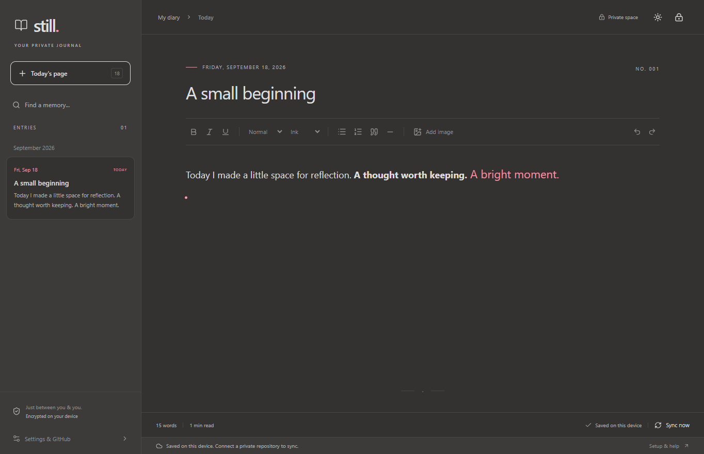

# Still Diary

**Open source. Your data stays with you. Encrypted before it leaves your device.**

A quiet, local-first diary for Windows and Linux. Write offline, autosave locally, and optionally back up encrypted entries and images to your own **separate private GitHub repository**.

## Why Still?

- **Free private storage.** Back up to a private repository on GitHub Free, with no Still subscription. [GitHub's usage limits apply](docs/README.md#cost-and-github-protections).
- **Private before it leaves your device.** Entries and images are encrypted locally, before they reach GitHub.
- **Your account, your control.** Use GitHub's private-repository access controls and protect your account with two-factor authentication.
- **Write anywhere, even offline.** Automatic local saves, rich text, images, and a quiet night theme.
- **Open source. Your keys. Your data.** No hosted diary service, analytics, or hidden recovery access.

## Install

[**Download the latest release**](https://github.com/adityagesh/still-diary/releases/latest) - no Node.js, npm, or source-code setup needed.

| Platform | Download v0.1.0 | Get started |
| --- | --- | --- |
| Windows, x64 | [Portable app](https://github.com/adityagesh/still-diary/releases/download/v0.1.0/Still-Diary-0.1.0-Windows-x64.exe) | Download and open the `.exe`. |
| Ubuntu / Debian, x64 | [Debian package](https://github.com/adityagesh/still-diary/releases/download/v0.1.0/Still-Diary-0.1.0-Linux-amd64.deb) | Open the `.deb` with your software installer. |
| Linux, x64 | [AppImage](https://github.com/adityagesh/still-diary/releases/download/v0.1.0/Still-Diary-0.1.0-Linux-x86_64.AppImage) | Make it executable, then open it. |

Builds are currently unsigned. [Installation commands, checksums, and troubleshooting](docs/README.md#install-from-a-release).

## Your first page

1. Open Still and choose **Create a diary**.
2. Pick an empty folder outside the app's installation or source directory.
3. Choose your **encryption passphrase** and save the **emergency recovery key** somewhere safe.
4. Start writing. Today's page is created automatically, and your changes autosave.

**Keep your recovery key safe: if you forget your passphrase and lose the key, there is no way to recover your diary.**

The first-login popup walks you through optional GitHub backup. Choose **I'll set this up later** to write offline. Night mode is the default.

**This public repository contains only the app, never your diary data.** Your diary belongs in your own private repository.

## More

[GitHub backup](docs/README.md#connect-github-using-ssh) · [Privacy & recovery](docs/README.md#recovery-and-privacy) · [Development](docs/README.md#build-from-source) · [Configuration & file format](docs/README.md#repository-schema) · [CI/CD & releases](docs/README.md#cicd-and-releases)

[MIT licensed](LICENSE). No hosted backend, analytics, or subscription.
